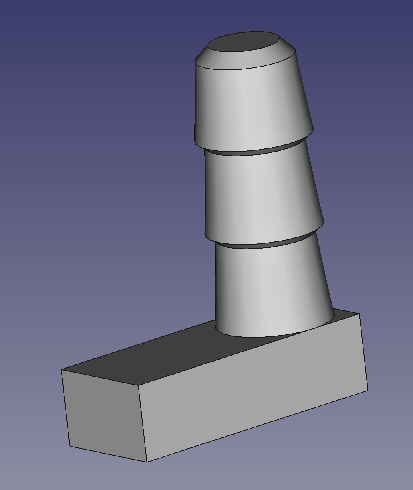

# Laser Cutter Honeycomb Peg

An alignment or hold-down peg for use in laser cutter honeycomb beds.

Inspired by [this printable](https://www.printables.com/model/369199/files) the peg was intended to be easier to print since it has a flat surface to print from.  You need good layer adhesion to make sure the peg doesn't snap off and a laser safe material in case of accidents.  PETG seems safe from my research.

Designed in FreeCAD 0.21.2 the file source file is included for download.
